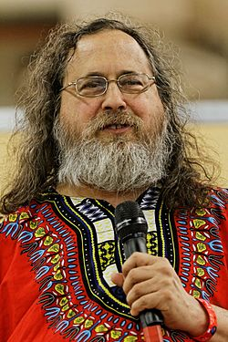
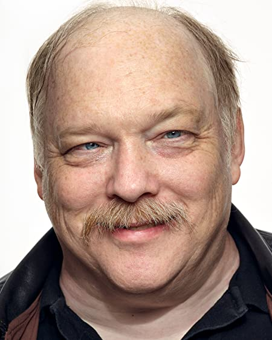
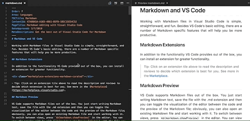

# Week1-1 강의 개요 (강의계획서)

### 수업목표
* Basic functional programming, _Haskell_
* Basicc concept and tools for **open-source software development**
* Attitude to self-learn **new SW tools and environment**
 
### 수업평가 방법
* 중간고사 30
* 기말고사 40
* 개별과제 20
* 수업참여도 5
* 출석 5
---

# Week1-2 오픈소스소프트웨어 개요

### Free Software VS Open Source Software
* Richard Stallman  
    

* Eric S. Raymond  
    
---

# Week2-1 버전 관리 개요

* Centralized VCS
    * One central repository with many users
    * E.g., _SVN_
* Decentralized(Distributed) VCS
    * Every user owns his or her local repository
    * A separate remote (central) repository
        * Sometimes, more than one remote (central) repositories
    * Two new actions (with remote repositories):  
    fork pull request
---

# Week2-2 Git

### Git이란 
> Git 개발과정 , 소스파일 등을 관리하는 도구
>
>Histroy 관리가 되어 개발되어온 과정 , 역사를 볼 수 있고 , 특정시점으로 복구가능

### Git Workflow

[image reference](https://techblog.woowahan.com/2553/)
---

# Week2-3 [Github], fork, pull request

### Github Training
><pre>  Don't think about git, 
>
>                            just do git </pre>

**[똑같이 따라 해보자](https://github.com/Taeung/git-training)**
---

# Week3     Markdown

### Topics
* Heading
* Italic, bold, etc.  
* Lists with bullets and numbers
* Links and images

### Editors
* [VS Code](https://code.visualstudio.com/docs/languages/markdown)
    *  Edit and preview (Ctrl-Shift-V)  
    
* [StackEdit](https://stackedit.io)

[Github]: http://github.com
